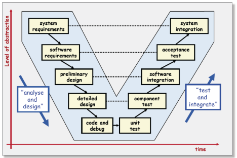

# CSCD01

- [CSCD01](#cscd01)
  - [Introduction and Notes](#introduction-and-notes)
    - [Waterfall](#waterfall)
    - [Agile](#agile)
    - [Key Process Stages](#key-process-stages)
  - [UML Diagrams (Union of all Modeling Languages)](#uml-diagrams-union-of-all-modeling-languages)
    - [Object Diagrams](#object-diagrams)
    - [Class Diagrams](#class-diagrams)
      - [Class Attributes](#class-attributes)
  - [Software Architecture](#software-architecture)
    - [Coupling and Cohesion](#coupling-and-cohesion)
    - [Architecture](#architecture)
  - [Reverse Engineering](#reverse-engineering)
  - [Sequence Diagrams](#sequence-diagrams)
  - [Use-case Diagrams](#use-case-diagrams)
  - [SDLC](#sdlc)
  - [Project Planning](#project-planning)
    - [COCOMO](#cocomo)
  - [Risk Analysis](#risk-analysis)
  - [Project Management](#project-management)
  - [Requirement Analysis](#requirement-analysis)
    - [Goal Modeling](#goal-modeling)
  - [Robustness Analysis](#robustness-analysis)
  - [Verification and Validation](#verification-and-validation)
  - [Testing Strategies](#testing-strategies)
    - [White Box Testing (Structural Coverage)](#white-box-testing-structural-coverage)
    - [Black Box Testing (Functional Coverage)](#black-box-testing-functional-coverage)
  - [Design by Contact](#design-by-contact)
    - [Java Modeling Language (JML)](#java-modeling-language-jml)
  - [Automating Testing](#automating-testing)
    - [Search Based](#search-based)
    - [Test Case Prioritization](#test-case-prioritization)
  - [Acceptance Testing](#acceptance-testing)
  - [Robot Framework](#robot-framework)
  - [Static Analysis](#static-analysis)
  - [Software Quality](#software-quality)
  - [Conclusion](#conclusion)

## Introduction and Notes

Some reasons that projects fail so often include:

- Unrealistic or unarticulated goals
- Inaccurate estimates of time, manpower, resources, or cost
- Poor communication between team members
- Poor management of dependencies
- Bad technology or development practices

### Waterfall


The waterfall model is a static way of developing code. It makes adjusting user requirements difficult, mostly used for large systems engineering projects where a system is developed at several sites (makes it easier to coordinate work), and where the model is already pre-defined (like computerizing warehouses).

### Agile

Allows for rapid development of software, and is used in large systems engineering projects. Easily add new features, user stories, and tasks. Values working software over comprehensive documentation, customer collaboration over contract negotiation.

### Key Process Stages

There are five key process stages in software development:

- Specification
  - Determining what services are required and the constraints on the systems operation and development
  - Includes the requirement engineering process: what do the system stakeholders require or expect from the system, define the requirements in detail, check validity of the requirements
- Design
  - Converting specifications and requirements into a design
- Implementation
  - Implement a system based on the desing that meets the requirements
- Validation and Verification
  - Intended to show that the system conforms to its specification and meets the requirements of the system customer
  - System testing is the most commonly use verification and validation process
- Evolution
  - The process of changing the system to meet the requirements of the customer during the systems life cycle

## UML Diagrams (Union of all Modeling Languages)

UML diagrams helps us understand project complexity, it abstractifies the project and decomposes it into smaller parts. We can produce UML's before coding, as a 'forward design', or after coding, as a 'backward design'. UML diagrams can be autogenerated and executed from code.

There are many different types of UML diagrams, they are shown below:


Here is some UML syntax:

- Actors
  - Actors are any point of interaction with the system (may be people, or other systems)
  - This is something external, and is not part of the system
- Boxes
  - Boxes are used to indicate discrete elements, groupings, and containment
- Arrows
  - Arrows indicate the direction of the relationship (dependency, association, generalization, etc)
  - The arrow is the relationship between two boxes
- Cardinatliy
  - Applied to arrows, relay the numerical relationship between elements (1 to 1, 1 to many, many to many, etc)
- Constraints
  - Allow notation of arbitrary constraints on model elements
  - To constriain the value of a class attribute
- Stereotypes
  - Word or short phrase that describes what the element does

### Object Diagrams

Object Diagrams display static classes as well as instantiated classes (objects).


Object diagrams uses Generalizations and Aggregations to show relationships between classes. Generalizations (shown with a line and triangle) indicate that a class is a subclass of another class. Aggregations (shown with a line and diamond) indicate that a class is composed of other classes. A good way to think about it is that in an aggregation, the top class cannot exist without the bottom classes, but in a generalization, the top class can exist without the bottom classes; the bottom classes simply extend the top class.


### Class Diagrams

Class diagrams are used to show the relationships between classes. We have previously used CRC cards for these, but now we will use UML diagrams. Design classes with care: low coupling, high cohesion, and SOLID principles. A UML Class Diagram is a pictorial representation of all the classes in an object oriented system; it shows their fields and methods and connections between these classes. It does not show details of interactions or algorithms.

Here are the following UML Class Diagram relationships:


- Association
  - This is a broad term, relflects any relationship between two classes (just a straight line)
- Directed Association
  - Directional relationship
- Reflexive Association
  - Reflects any logical connection or relationship between classes
- Aggregation
  - Refers to the formation of a particular class as a result of one class being aggregated or build as a collection
  - Contain classes are not strongly dependent on the lifecycle of the containing class (libarary to books)
- Composition
  - Similar to aggregation, but the contained class is destroyed once the containing class is destroyed (Book to page)
- Inheritance / Generalization
  - One associated class is the child of another, assuming the same functionalities as the parent class
- Relaization
  - Implementation of the functionality defined in one class by another (think interface to implementation in Java)

Bidirectional relationships are shown with a double arrow, they indicate a two way relationship, but are hard to implement correctly.

#### Class Attributes


Abstract classes are denoted by italics, interface classes are denoted by \<\<interface\>\> being placed above the class name. Generalizations have the arrow pointing to the parent class, interfaces are dotted lines, abstract are solid lines with white arrows, classes are solid lines with black arrows.

## Software Architecture

### Coupling and Cohesion

As always, we want to minimize coupling (modules don't need to know too much about one another to interact, makes future changes easier) and maximize cohesion (contents of each module are strongly related, subcomponents belong together)

Efferent Coupling ($e_c$) measures the number of classes on which a given class depends. Affernt Coupling ($a_c$) measures the number of classes that depend on a given class. The instability index measures the ratio of these two values.

$$ i = \frac{e_c}{e_c + a_c}$$

The closer this number is to 0 the better.

We can also measure the cohesion of a class. The cohesion of a class is the inverse of the count of the number of method pairs whose similarity is 0.

An example is with a class with three methods:

```python
class A:
    def method1(self, a, b, c):
        pass
        
    def method2(self, a, b, c):
        pass
        
    def method3(self, a, b, c, d):
        pass
```

This class has two methods with the same number of parameters, but three total. The cohesion of this class is:

$$\frac{1}{ \# \: of \: classes - \# \: of \: distinct \: classes} = \frac{1}{3 - 1} = \frac{1}{2}$$

### Architecture

Conway's Lay states that "The structure of a software system reflects the structure of the organization that built it".

The following image is an example of a three layer architecture system:


We can also define architecture in terms of UML. UML diagrams can be designated into packages, which are then shown in a package diagram. Package diagrams are shown as simple folders, and interfaces can be added inside the folder to show the members of said package.


We can also define architecture in terms of Component Diagrams. These are used in modeling the physical aspects of an object-oriented system.


Closed layer architecture only allows layers to use services of those directly underneath them, open layered allows services to be used by any layer.

Pipe and filter architecture is a way to model the flow of data through a system. Unix uses these. Filters do not need any information about who they are connected to, can be implemented in parallel.

A brokered system is one in which clients and servers are connected through middleware. These allow a level of abstraction beteen the client and server, but can be slow (brokers are a bottleneck).

Event-based systems listen for events. Components have no control over computations. Examples are GUI's, debugging systems and DBMS.

Repositories are used to store data in a central locaiton. The location can become a bottleneck, but it reduces duplicate code.

## Reverse Engineering

Software continuously evolves, we need to figure out how to understand legacy code.

Program Types

- S-type
  - Specifiable, problem can be stated formally and completely (no evolution is relevant)
  - Math and logic related
- P-type
  - Problem-solving, impercise statement of a real world problem
  - Example is a game of chess
- E-type
  - Embedded, software that becomes part of the world that it models
  - Usually for automating human activity (Operating systems, inventory management, etc)

User requirements always grow.

Software Geriatrics

- Causes of Aging
  - Software aging is usually caused by a failure to maintain code, meet user requirements, or evolve the code
  - Changes in software usually tend to  reduce cohesion and increase complexity
- Costs of Aging
  - Software gets buggy with age, owners of aging software need to keep up with the marketplace
- Ways to decrease aging
  - Design for change
  - Document carefully
  - Requirements and designs should be reviewed by those responsible for its maintenance

Maintenance Methods

- Adaptive Maintenance
  - Accounts for 25% of maintenance costs
  - This occurs when the software needs to be modified after delivery to ensure it is still usuable
- Corrective Maintenance
  - Roughly 20% of maintenance costs
  - Correcting issues you identified during deployment or release
- Perfective Maintenance
  - Approximately 5% of maintenance costs
  - Improving software for efficiency

Maintenance is hard. Lack of knowledge, documentation, and quality of code can cause problems. The Rejuvenation of code is redocumentation, refactoring, and revamping code to make it more efficient. Revamping is changing the UI, refactoring has no changes to functionality, but reengineering will make real changes to the code.

Interaction diagrams are used to model dynamic aspects of a system, they aid the developer in visualizing the system as it is running. These are the most used UML diagrams behind Class diagrams.

A message is how objects communicate.

## Sequence Diagrams

Maintenance is hard. Lack of knowledge, documentation, and quality of code can cause problems. The Rejuvenation of code is redocumentation, refactoring, and revamping code to make it more efficient. Revamping is changing the UI, refactoring has no changes to functionality, but reengineering will make real changes to the code.

Interaction diagrams are used to model dynamic aspects of a system, they aid the developer in visualizing the system as it is running. These are the most used UML diagrams behind Class diagrams.

A message is how objects communicate.

The sequence diagram is one of the most commonly used interaction diagrams. They are build around an X-Y axis, objects are aligned at the top parallel to the X-axis, messages travel parallel to the X- axis, whereas time travels along the Y-axis.


Loops are shown in boxes.


You should use Sequence Diagrams when:

- Comparing Design Options
  - Sequence diagrams will show you how objects collaborate to carry out a task
- Assessing Bottlenecks
  - Sequence diagrams will show what objects are called on the most, and how this may effect efficiency
- Explaining Design Patterns
- Elaborating Use Cases

## Use-case Diagrams

Use cases are a technic used to frame the functional requirements of a system, they describe typical interactions between the users of a system and the system itself.

Actors are users of the system, they have names and is associated with one or more use case. Actors need not be humans, they can be other systems. Use cases are represented with ovals, actors with stick figures.

Use cases do not describe the flow of events, but addresses tasks that actors may carry out and the relationships between those tasks.


<<includes\>\> means that this case incoporates the behaviour of another use case specificed at the base (usually <<uses\>> is used instead). Used like a procedure call.

<<extends\>\> means that this case incorporates the behaviour of another use case indirectly specified at the base

You can also add generalizations to the actors (split customer into commercial or consumer).

When describing a use case, give a detailed flow of events from the actors perspective.


## SDLC

The software development lifecycle is a set of steps that are used to develop software. There is always existing software, so you must first understand the existing software before being able to expand on it.

There are a few development models, each with their own set of steps. The first is Waterfall (we've seen this before). The second is the "V-model", as shown below.



A third is the "Spiral model", as shown below.


The Rational Unified Process (RUP) is a model for SDLC. It defines the steps that are used to develop software, including inception, elaboration, construction, and transition.


## Project Planning

When planning a project, the project manager needs to account for the following:

- Customer requirements
- Estimates
  - How long each user story will take to implement
  - How important is each user story
- Plan
  - Which user story will be implemented first
- Complication
  - Security, usability, performance, etc: all customer inputs

Managers can only control resrouces, time, product, and risk. They cannot control everything, and therefore, need to plan out the project appropriately.

Managers can use different strategies to plan out the project. One of these is fixed product. In this, the manager must idenfity the customer requirements. Costs and time is variable, but the product is fixed. An alternate is fixed schedule, where a timeframe for each release is fixed. In this scenario, requirements are planned out against the release schedule, and costs vary. The third is fixed cost, and I'm sure you can imagine how it works.

### COCOMO

COnstructive COst MOdeling is a model for estimating the cost of a project by its size (lines of code) and is calculated using the following formula:

$$ Effort = aL^b$$
  
where: a and b are project parameters, and L is the number of lines of code.

There is also a strategy called "three point estimating" where the worst case, best case, and most probable case are estimated.

$$Effort = \sum_i \frac{w_i + 4m_i + b_i}{6}$$
  
where:

- w_i is the worst effort to implement the ith user story
- m_i is the most probable effort to implement the ith user story
- b_i is the best effort to implement the ith user story

Burndown charts are also very important when it comes to Agile estimation.

## Risk Analysis

Risk is not inherently a bad thing, but we must be able to analyze and control it. Here are some important concepts:

$$Risk \: Exposure = P(Unwanted \: Outcome) * Loss(Unwanted \: Outcome)$$
$$Risk \: Reduction \: Leverage = \frac{RE_{before} - RE_{after}}{cost \: of \: intervention}$$

Risk assessment can be quantitative (like using the equations above) or qualitative (like using the risk matrix).


The top Software Engineering Risks are:

- Personnel Shortfalls
- Requirement Changes
- Unrealistic Schedules/Budgets
- Developing Wrong Software Functions
- Shortfalls in quality cmponents
- Shortfalls in externally provided services
- Performance shortfalls
- Straining CS abilities
- Gold Plating
- Developing wrong UI/UX

In case of an error, list what could have gone wrong in order of probability. Software bugs hide behing other bugs (so a full regression test is necessary). You can also create trees to analyze the problem.

## Project Management

Gantt Charts are a useful tool for project management. They show the project schedule, and can be used to visualize the project.


As are PERT Charts.


Meetings are also a good tool for project management. They are used to discuss the project, and to discuss the project's progress. They are expensive though. Eight people on 60k an hour means that a meeting costs $480 per hour.

## Requirement Analysis

Software is designed for human activity. We need to determine the requirements that the system will perform to meet this human activity. Separate the problem from the solution before development begins.

We need to identify the stakeholders in out project, and determine their goals. Focus on why the system is required.

### Goal Modeling

Determine the goals (functional requirements) of the system. Figure out the agents of those goals (who owns them) and the softgoals (cannot be satisfied, like efficiency, performance, security, etc). Softgoals are essentially qualitative, while goals are quantitative.

Here are the steps needed to determine the requirements

- Identify Actors
  - Determine the primary users of the system, who will maintain, use, and/or modify the system
- Build a domain model


- Goal Model
  - Explore goals and softgoals, and determine the priority of each goal
- Obstacle Analysis
  - Determine obstacles to goals, what could go wrong when trying to reach the goal
- Scoping
  - Determine the scope of the problem and the difficulty of the solution
  - Determine reasonable solutions to the problem
- Use Cases
  - Use use case diagrams to model the goals
  - You can also sample use cases with documentation


## Robustness Analysis

Once you have all of the requirements of your system (use cases, domain models, and stakeholder goal models), you can begin to determine the robustness of your system.

The law of Demeter says that you should "only talk to your friends". Essentially, in programmer terms, you should only ever use one dot. Something like "Customer.PayPalAccount.CreditCard.subtract(total)" should be replaced with "Customer.GetPayment(total)".

There are some unique concepts when it comes to robustness, shown below:


Robustness bridges the gap between requirements and design. Compare the robustness diagram with each use case.

ICONIX is a process for determining the robustness of a system. You take a storyboard task, determine a use case model, then a robustness diagram, then a sequence diagram, then made domain and class models, write the code and unit tests, then test.


## Verification and Validation

Verification and Validation are meant to determine if the system we are building is correct.

Validation deals with determining if the problem statement captures the real problem, and if we account for stakeholders needs. This is done with prior knoelwedge (customer feedback), observations, models, and simulations. You can validate a design using model inspection tools, building protoypes, or getting users to try it.

Verification is more about the system itself, and asks if the design meets the specifications, if the implementation meets the specifications, if the delivered system does what we said it would do, etc. This is done with testing, reviews, and documentation


- Prototyping
  - Explain, demonstrate, and inform the user of the system **then throw away**
- Usability Testing
  - Real users try out the system or prototype (3-5 gives best ROI)
- Model Analysis
  - Verify the model is well formed
  - Validate that the model catches corner cases, animation of model on small examples
- UML Consistency
  - Check use case diagrams, each use case has a user and each user has at least one use case
  - Check class diagrams, does the code follow the diagram and does the diagram make sense
  - Check sequence diagrams, is each class in the class diagram, can each message be sent
- Model Checkers
  - Automated, idfk what this is
- Inspections
  - Management reviews, walkthroughs, inspections, etc.

## Testing Strategies

There are many causes of defects in software. Defects may lead to failures. Some defects are:

- Syntax Faults
- Stress Faults (stack overflows)
- Algorithmic Faults
- Timing Faults (synchronization)
- Precision Faults (floating point errors)
- Throughput Faults (performance is worse than expected)
- Documentation Faults
- Recorvery Faults (incorrect backups)
- Hardware Faults

HP says that most faults (50%) are caused by Logic and Computation.

Defect Detection Effectiveness:


Quality is free, and removing defects early saves you lots of money. Testing and quality however, are hard. You can prove the correctness of an algorithm, but not of a whole system. Testing does not improve quality, it just reinforces it.

There are many different types of testing.

Partitioning testing means to partition the set of behaviours of the system, and test each partition independently. This method is implemented using White box and Black box testing.

There is also integration testing, which means to test the system as a whole. Unit tests are created to check the correctness of each function. Integration testing is testing multiple units to check to ensure that they work together. This is hard, its hard to identify which units cna go together.

Developer testing is good (writing test cases first) but limited, and is not always the best way to test. Developers overestimate test coverage and have an emphases on clean tests.

### White Box Testing (Structural Coverage)

This is the minimal set of tests to cover every branch of a system. State with one test for a straight path, add one for each word : if, while, repeat, for, and , or. Add one for each branch of a case statement.

You can put these into a chart, called an MC/DC (Modified Condition/Decision Converage) coverage chart, which shows each basic condition and the resulting coverage. Take the minimal set of these and write a test case for each set.


MC/DC has several advantages:

- Growth is linear
- Ensures coverage of the object code
- Discovers dead code

Used by Boeing and Lockheed Martin. The cost of aircraft developemtn was an estimated 5.5 billion dollars. The cost of testing to MC/DC criteria was approximately 1.5 billion dollars.

### Black Box Testing (Functional Coverage)

Dataflow Testing, data is:

- Defined
- Used
- Killed
- ENtered
- EXited

A normal life of data says that it is defined once, used a number of times, then killed.

Some defects could be:

- D:D
  - Data is defined twice
- D:Ex, D:K
  - Data is defined, but not used
- En:K
  - Destroying a local variable that wasn't defined
- K:K
  - Unnecessary killing, can hang the machine
- K:U
  - Using data after it has been destroyed
- U:D
  - Redefining data after usage

You need to test all D:U paths. 1 test for each path from each definition to each use of a variable. An example is shown below.


Each boundary of a function needs three values, one for MAX + 1, MAX - 1, and MAX.

You can also generate test cases from use cases. Determine preconditions and postconditions, and then generate test cases.


Classes can have bad data: too little or too much, wrong kind or wrong size.

You should stress test.

Quick tests are also a thing. Try repeated variables, variability, boundaries, etc. Look towards Whittakers Quick Tests.

Intereference testing is also a thing. Change the context, generate interrupts, cancel or pause a task. Write a program to compete for resources.

Exploratory testing is also also a thing. Try to fine defects that reduce the value of the software to a favoured stakeholder or increase its value to a disfavoured stakeholder. You cannot follow a script for testing, follow the clues and learn as you go.

## Design by Contact

### Java Modeling Language (JML)

JML is a formal specification language for sequential Java. It supports the following features:

- Preconditions
- Postconditions
- Loop invariants
- Class invariants

Properties are specified in Java syntax, namely as Java boolean expressions (\old, \forall, \result).

Method specifications are in JML. There are different versions, where it requires, ensures, assignable, signals, singals_only (exceptions) and diverges formulas.

A JML formula is a Java boolean expression.

- \old(expression)
  - The value of expression before the method was called.
- \result
  - The value of the expression after the method was called.
- F ==> G states that F implies G
- \forall x, y, ..., z; F states that for all x, y, ..., z, F holds.

Class

- Invariant formula
  - Whenever a mmethod is called or returns, this formula must be true
- Constraint Formula
  - Relation between pre-state and psot state that has to hold for each method invokation

Loop

- Loop_invariant formula
  - Must hold during all iterations of the loop
- Decreases Expression
  - Expression of type long or int that must be no less than 0 when the loop is executing, and must decrease with each iteration of the loop.

A method without side effects is called pure.

```java
public /*@ pure @*/ int foo(int x);
```

Preconditions for a method can be specified using requires:

```java
public /*@ requires x > 0; @*/ void foo(int x);
```

Postconditions can be specified using ensures:

```java
public /*@ ensures result > 0; @*/ void foo(int x);
```

Invariants can be specified using invariant:

```java
public class BankAccount{
  final static int MAX_BAL = 1000;
  int balance;
  /*@ invariant 0 <= balance && balance <= MAX_BAL; @*/
}
```

You can use "non_null" to specify that a variable is not null (since this is what most invariants, pre- and postconditions are about).

```java
public class BankAccount{
  final static int MAX_BAL = 1000;
  int balance;
  /*@ invariant 0 <= balance && balance <= MAX_BAL; @*/
  /*@ non_null @*/ BankAccount other;
}
```

Assert specifies a clause that should hold at some point in the code.

```java
public class BankAccount{
  final static int MAX_BAL = 1000;
  int balance;
  /*@ invariant 0 <= balance && balance <= MAX_BAL; @*/
  /*@ non_null @*/ BankAccount other;
  
  public void deposit(int amount){
    assert amount > 0;
    balance += amount;
  }
}
```

Exceptional postconditions can be specified using signals:

```java
/*@ signals (Exception e) true; @*/
public void foo(int x){
  if(x < 0){
    throw new Exception();
  }
}
```

Assignable tags state that a function can only assign to a variable.

```java
public class BankAccount{
  final static int MAX_BAL = 1000;
  int balance;
  /*@ invariant 0 <= balance && balance <= MAX_BAL; @*/
  /*@ non_null @*/ BankAccount other;
  
  /*@ assignable balance; @*/
  public void transfer(int amount){
    assert amount > 0;
    assert amount <= balance;
    balance -= amount;
    other.balance += amount;
  }
}
```

Use '//@' to define decreasing:

```java
public class BankAccount{
  final static int MAX_BAL = 1000;
  int balance;
  /*@ invariant 0 <= balance && balance <= MAX_BAL; @*/
  /*@ non_null @*/ BankAccount other;
  
  /*@ decreasing balance; @*/
  public void withdraw(int amount){
    assert amount > 0;
    assert amount <= balance;
    balance -= amount;
  }
}
```

You can make JML as weak or as strong as you want. Implications are evaluated in short-circuit fashion (left to right). You can make equalivalencies to or and not.

<==> and <=!=> have the same meaning as == and !=, respectively.

An example of this is shown below:


Quantifiers

- \max
- \min
- \product
- \sum
- num_of
- \exists
- \forall

```java
(\sumint i; 0 <= i&& i< 5; i) == 0 + 1 + 2 + 3 + 4 
(\productint i; 0 < i&& i< 5; i) == 1 * 2 * 3 * 4 
(\maxint i; 0 <= i&& i< 5; i) == 4 
(\minint i; 0 <= i&& i< 5; i-1) == -1
```

A good exercise is to take binary search, and make it JML.

## Automating Testing

Whenever you can, you should automate testing. You will need test drivers, test cases, and test frameworks. UUT stands for Unit Under Test, it is the object being tested.


You can use JUnit to write tests, and create assertions:

```java
fail;
assertTrue(true);
assertFalse(false);
assertNotNull(x);
assertNull(x);
assert_raises(Exception e, () -> {throw new Exception();});
assertEquals(x, y);
assertEquals(x, y, tolerance);
```

Some principles of automated testing include:

- Write test cases first
- Isolate the UUT
- Test via a public interface, avoid creating backdoor methods
- Don't modify UUT, avoid double tests and test-specific subclasses
- Keep tests independent
- Keep test logic out of production code
- Test concerns seperately

There are some tools (like UMLet) that can help you see the results of your tests and interact with them. But there are some challenges when it comes to testing:

- Synchronization
  - How do we know when a window popped up that we can click
- Abstraction
  - How do we know if it was the correct window
- Portability
  - Does our code change for different platforms?

To test presentation layers, you can script mouse and keyboard events, script the application, or write APIs for your application.

Keep in mind dependencies, some files may rely on others, and testing one tests the other.

Testing OOP Code is a bit more difficult than testing procedural code. You must keep the following in mind:

- Encapsulation
  - If an object hides it's internal state, we need to add methods to expose this state, only to be used in testing (keep in mind adding methods to expost internal states may have faults in them, so you should only do this if you are sure you need to)
- Inheritance
  - We need to test all overridden methods, and all subclasses
- Polymorphism
  - Make sure you are dealing with the right classes

No matter how you test, we need to ensure that we stop testing at the right time. There is a nice formula for this, which is based on the notion that if failures decrease as testing time increases, we can stop testing:

$$ \frac{ln (\frac{fd}{\frac{1}{2} + fd}) * th}{ln(\frac{\frac{1}{2} + fd}{tf + fd})}$$

Where:

- fd is your target failure density (eg 0.03 failures per 1000)
- tf is your total test failures observed sofar
- th is the total testing hours up to the last failure

Contrary to this, Motorola has a different formula:

$$failures = ae^{-b(t)}$$
  
Where:

- t is testing time
- a, e, and b are empirical constants

There is also such a thing as Automatic Test Case Generation. These systems develop test cases automatically for your underlying code. They randomly generate inputs to feed into a software, however, they are redundant a lot of the time and sometimes do not find edge cases.

They may become useful when you use distributions, so instead of a random number the numbers will follow a specific pattern.

Randoop is a feedback guided tool developed by MIT and Microsoft. It is a tool that generates test cases for you.

### Search Based

You can also view test case generation as an optimazation problem. You need to find the minimum number of input values that will achieve the best coverage. Try to find the maximum or minimum of a certain function, and use those to derive the minimum number of inputs.

There are some strategies for this:

- Hill Climbing
  - Pick a random point, check all neighbours and go to the point with the highest value, repeat until a local maximum is found.
  - Repeat many times to avoid local peaks.
- Annealing Simulation
  - Same as hill climbing but with a probability to restart after reaching a local peak (probability goes down as time goes up)
- Genetic Algorithm
  - Start with random points, select a number of best points and combine and mutate them, repeat until no more improvements can be made

The peak in these strategies is the most efficient or performative way to solve the problem.

EvoSuite was created in 2010 as a search based test generator.

### Test Case Prioritization

Based on a few things:

- Code Coverage
  - The more code we cover, the more we can check
- Similarity
  - Rank each test case based on the similarity between a test case and the changed source code
- History
  - Run tests that failed in last runs

There are also some ranking strategies

- Total
  - Rank tests based on their code coverages, each time pick the case that has the largest coverage
- Additional
  - Total to picck starting point, then pick the case with the largest additional coverage

## Acceptance Testing

Acceptance testing is formal testing conducted to determine whether a system satisfies the acceptance criteria. There are two types, UAT (User Acceptance Testing) and BAT (Business Acceptance Testing). UAT is done by the customer, to ensure the system satisfies the contract. BAT is done by the development organization, to ensure that the system wil eventually pass the UAT.

Acceptance Criteria is based on many attributes:

- Functional Correctness and Completness
- Accuracy
- Usability
- Documentation
- Stress
- Reliability
- Competitive Edge

and more.

Customers select a subset of quality attributes (IBM USES CUPRIMDS: Capability, Usability, Performance, Reliability, Installation, Maintenance, Documentation, and Service).

A plan for Acceptance Testing is shown below:


Acceptance Test Cases are divided into two groups, basic cases and more complex cases. Basic cases are run first, if they perform well, more complex cases are run. Developers must train customers on the usage of the system, and must resolve and issues arising from acceptance testing discrepencies. If needed, developers can make Acceptance Criteria Changes (ACC) and fill out forms. During the execution of the acceptance tests, the acceptance team prepares daily reports (ATR).


In an extreme programming framework, user stories are used as acceptance criteria.

## Robot Framework

Robot Framework is a python based open source test automation and RPA ecosystem. Developed by Nokia. It is a framwork for multi-channel testing, and provides a unified way to access target systems with library keywords. It can test frontend and backend in one run, used to test web apps, mainframes, and embedded systems.

## Static Analysis

These are linters, static program mistake detectors, and more. Some tools include:

- FindBugs
- JLint
- PMD
- ESC/Java

They give you static code checking, stating unused variables, possible null detection, and more.


There are a large number of false positives (reports that arent bugs), and a good number of false negatives. Many of the bugs found are low priority and probably harmless.

## Software Quality

Quality is not a quantifiable trait, it is based on the user experience.

Quality can be divided into four views:

- Quality in use
- External attributes
- Internal attributes
- Process quality

Verification and Validation focus on the quality of the products, but quality assurance focuses on the quality of the processes - are they well documented, do people follow them, does the team learn from its mistakes, etc.

I don't know what Six Sigma is but it is a great way to measure the quality of a product.


The regions on the left and right of the graph essentially mean too much and too little 'paint', which is the amount of defectiveness of a product.

There are two ways to remove defects: fix the defect in each product (through patches) or fix the process that leads to defects (prevent them from occuring).

(Humphrey) Programmers must evaluate their own errors, feedback is essential for defect prefention. There is no cure for defects, programmers must eliminate causes one by one.

CMM:


Six Sigma is a good way to determine the acceptance of defects in a system, but it is not ideal for software development. The best military systems in the world have 5 faults / KLOC. Six sigma says that only 0.0034 faults / KLOC are acceptable. NASA has 0.1 faults / KLOC.

There are some arguments against Quality Assurance

- Cost may outweight benefits
- Reduced agility
- Reduced thinking
- Barrier to innovation
- Demotivation

You can measure quality though reliability, efficiency, maintainability, and usability. Boehm has made a Quality map to do this:


## Conclusion

That's it! Good luck on the final!
